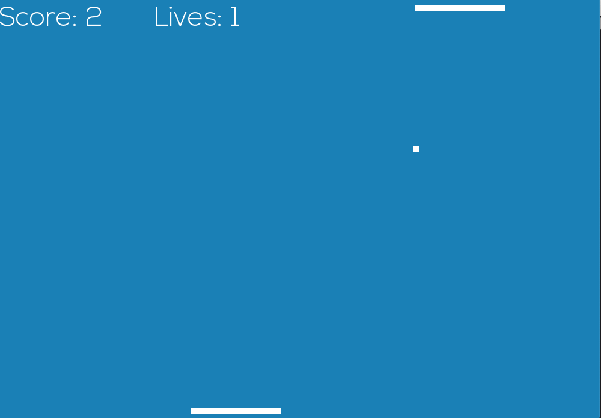
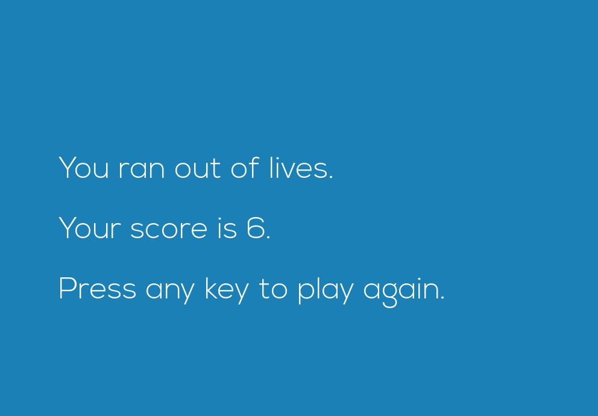

# Pong-SFML
A Pong game written in C++ with SFML

Make sure you have the SFML Library installed and run the .cp file "Pong"

If the font does not load then make sure to copy the entire pathname of the font file from your device and paste it in the program: font.loadFromFile("/Users/xxx/xxx/Nexa Light.otf");

That's all! Enjoy

## Screenshots

